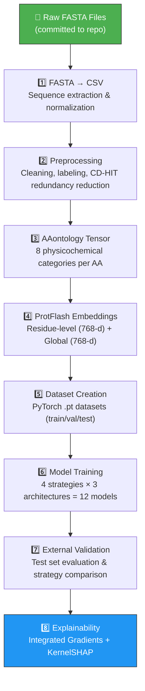

# 🧬 ProtFlash AMP Classifier

<div align="center">

**Antimicrobial Peptide Classification using ProtFlash Embeddings, AAontology Enrichment, Mean/Gated Pooling, and Deep Learning Architectures**


</div>

---

## 📋 Table of Contents

- [Overview](#overview)
- [Pipeline Architecture](#pipeline-architecture)
- [Repository Structure](#repository-structure)
- [Dataset](#dataset)
- [Modeling Strategies](#modeling-strategies)
- [Model Architectures](#model-architectures) 
- [Training Details](#training-details)
- [External Validation Results](#external-validation-results)
- [Final Selected Model](#final-selected-model)
- [Explainability (XAI)](#explainability-xai)
- [Installation](#installation)
- [Usage](#usage)
- [Requirements](#requirements)
- [Authors](#authors)
- [Citation](#citation)
- [License](#license)

---

<a id="overview"></a>
## 🎯 Overview

This repository contains a complete pipeline for binary classification of **Antimicrobial Peptides (AMPs)** using protein embeddings generated by **ProtFlash**. The project explores multiple sequence aggregation strategies and deep learning architectures to identify AMPs from raw protein sequences.

### Problem Statement

Antimicrobial peptides (AMPs) are crucial components of innate immunity and promising therapeutic candidates against antibiotic resistance. Accurate computational identification of AMPs from protein sequences remains an open challenge in bioinformatics.

### Approach

This project combines:
- **ProtFlash contextual embeddings** (768-dim) at residue and sequence level
- **AAontology enrichment** with 8 physicochemical property categories per amino acid
- **Aggregation strategies**: Mean Pooling and Gated Pooling
- **Deep learning architectures**: MLP, 1D-CNN, and BiLSTM
- **Explainability (XAI)**: Integrated Gradients and KernelSHAP for residue-level interpretation

### Repository Content

> ⚠️ **Important:** This repository contains **only the raw `.fasta` sequence files** and the **Jupyter notebooks** that implement the full pipeline. All intermediate and final artifacts (CSV files, embeddings, datasets, model checkpoints, metrics, and figures) are **generated during execution** and are **not committed** to the repository.

---

<a id="pipeline-architecture"></a>
## 🏗️ Pipeline Architecture



### Pipeline Stages

| Stage | Notebook(s) | Input | Output |
|---|---|---|---|
| 1. FASTA → CSV | `01_fasta_to_csv.ipynb` | Raw `.fasta` files | Normalized `.csv` files |
| 2. Preprocessing | `02_preprocess_input.ipynb` | CSV files | Cleaned, labeled, CD-HIT filtered CSVs |
| 3. AAontology | `03_aaontology_tensor_generator.ipynb` | AAontology scales | `AAontology_zscored.pt` (21×8 tensor) |
| 4. Embeddings | `04_embeddings_generate.ipynb` | Sequences + ProtFlash model | Residue & global embeddings (`.npy`) |
| 5. Dataset Creation | `05_create_dataset.ipynb` | Embeddings + metadata | PyTorch `.pt` datasets |
| 6. Training | `06_*` to `17_*` (12 notebooks) | `.pt` datasets | Trained model checkpoints |
| 7. Validation | `18_*` to `22_*` (5 notebooks) | Checkpoints + test set | Metrics, figures, comparison tables |
| 8. Explainability | `23_xai_best_strategy.ipynb` | Best model + test set | Attribution maps, SHAP values |

---

<a id="repository-structure"></a>
## 📂 Repository Structure

```text
protflash-amp-classifier/
├── 📂 01_data_preprocessing/
│   ├── ✅ 01_fasta_to_csv.ipynb
│   ├── ✅ 02_preprocess_input.ipynb
│   └── ✅ 03_aaontology_zscored_tensor_generator.ipynb
│
├── 📂 02_embedding_generation/
│   ├── ✅ 04_embeddings_generate.ipynb
│   └── ✅ 05_create_dataset.ipynb
│
├── 📂 03_model_training/
│   ├── 📂 mean_pooling/
│   │   ├── ✅ 06_mean_pooling_mlp.ipynb
│   │   ├── ✅ 07_mean_pooling_cnn.ipynb
│   │   └── ✅ 08_mean_pooling_lstm.ipynb
│   ├── 📂 mean_pooling_aaontology/
│   │   ├── ✅ 09_mean_aaontology_mlp.ipynb
│   │   ├── ✅ 10_mean_aaontology_cnn.ipynb
│   │   └── ✅ 11_mean_aaontology_lstm.ipynb
│   ├── 📂 gated_pooling/
│   │   ├── ✅ 12_gated_pooling_mlp.ipynb
│   │   ├── ✅ 13_gated_pooling_cnn.ipynb
│   │   └── ✅ 14_gated_pooling_lstm.ipynb
│   └── 📂 gated_pooling_aaontology/
│       ├── ✅ 15_gated_aaontology_mlp.ipynb
│       ├── ✅ 16_gated_aaontology_cnn.ipynb
│       └── ✅ 17_gated_aaontology_lstm.ipynb
│
├── 📂 04_validation/
│   ├── ✅ 18_mean_pooling_external_validation.ipynb
│   ├── ✅ 19_mean_aaontology_external_validation.ipynb
│   ├── ✅ 20_gated_pooling_external_validation.ipynb
│   ├── ✅ 21_gated_aaontology_external_validation.ipynb
│   └── ✅ 22_strategy_comparison.ipynb
│
├── 📂 05_explainability/
│   └── ✅ 23_xai_best_strategy.ipynb
│
├── 📂 data/
│   └── 📂 raw/                        
│       ├── ✅ train_pos.fasta
│       ├── ✅ train_neg.fasta
│       ├── ✅ val_pos.fasta
│       ├── ✅ val_neg.fasta
│       ├── ✅ test_pos.fasta
│       └── ✅ test_neg.fasta
│
├── ✅ .gitignore
├── ✅ CITATION.cff
├── ✅ LICENSE
├── ✅ README.md
└── ✅ requirements.txt

```
---

<a id="dataset"></a>
## 🧪 Dataset

### Raw Input Data

The only data files committed to this repository are the raw **FASTA files** containing protein sequences:

| File | Class | Sequences |
|---|---|---:|
| `train_pos.fasta` | Positive (AMP) | 6,127 |
| `train_neg.fasta` | Negative (non-AMP) | 7,639 |
| `val_pos.fasta` | Positive (AMP) | 1,836 |
| `val_neg.fasta` | Negative (non-AMP) | 2,292 |
| `test_pos.fasta` | Positive (AMP) | 4,914 |
| `test_neg.fasta` | Negative (non-AMP) | 10,771 |

### Generated Dataset Summary

After running the preprocessing and embedding generation stages, the following datasets are produced:

| Split | Sequences | Positive | Negative | Pos Ratio |
|---|---:|---:|---:|---:|
| Train | 13,766 | 6,127 | 7,639 | 0.80 |
| Validation | 4,128 | 1,836 | 2,292 | 0.80 |
| Test (external) | 15,685 | 4,914 | 10,771 | 0.46 |

### Sequence Processing

- **Minimum length:** 10 residues (shorter sequences are padded with `X`)
- **Maximum length:** 100 residues (longer sequences are truncated)
- **Redundancy reduction:** CD-HIT at 95% sequence identity (train and val splits only)
- **Embedding dimension:** 768 (ProtFlash-base, 175M parameters)
- **AAontology features:** 8 physicochemical categories per amino acid (z-scored)

### Generated Data Tensors

Each sample in the final PyTorch datasets contains:

| Tensor | Shape | Description |
|---|---|---|
| `X` | `(100, 768)` | ProtFlash residue-level embeddings |
| `G` | `(768,)` | ProtFlash global/CLS embedding |
| `M` | `(100,)` | Binary mask (1 = valid residue, 0 = padding) |
| `Ont` | `(100, 8)` | AAontology physicochemical profiles (AAontology models only) |
| `seq` | `str` | Raw amino acid sequence |
| `y` | `(1,)` | Binary label (1 = AMP, 0 = non-AMP) |

---

<a id="modeling-strategies"></a>
## 🧠 Modeling Strategies

### Aggregation Strategies

| Strategy | Description |
|---|---|
| **Mean Pooling** | Simple masked average of residue embeddings |
| **Mean Pooling + AAontology** | Mean pooling + AAontology physicochemical profiles as additional input |
| **Gated Pooling** | Learned attention gates that weight each residue's contribution |
| **Gated Pooling + AAontology** | Gated pooling conditioned on both embeddings and AAontology profiles |

<a id="model-architectures"></a>
### Model Architectures

| Architecture | Variants | Key Components |
|---|---|---|
| **MLP** | Small / Medium / Large | Linear + BatchNorm + GELU + Dropout |
| **1D-CNN** | Small / Medium / Large | Conv1d + BatchNorm + GELU + Max/Avg Pooling |
| **BiLSTM** | Small / Medium / Large | Bidirectional LSTM + Max/Avg Pooling |

**Total configurations evaluated:** 4 strategies × 3 architectures = **12 models**

---

<a id="training-details"></a>
## ⚙️ Training Details

The training notebooks use a common reproducibility and optimization setup.

### Reproducibility

```text
SEED = 31
```

### Optimization

| Parameter | Value |
|---|---:|
| Batch size | 128 |
| Max epochs | 100 |
| Early stopping patience | 12 |
| Minimum improvement delta | 1e-4 |
| Optimizer | AdamW |
| Loss function | FocalLoss (α=0.75, γ=2.0) or BCEWithLogitsLoss with pos_weight |
| Scheduler | ReduceLROnPlateau |
| Gradient clipping | Enabled |

### Evaluation Threshold

External validation uses a fixed classification threshold:

```text
threshold = 0.5
```

---

<a id="external-validation-results"></a>
## 📊 External Validation Results

### Performance on External Test Set

| Strategy | Best Model | Params | Test Acc | Test F1 | Test MCC | ROC-AUC | PR-AUC |
|---|---|---:|---:|---:|---:|---:|---:|
| Mean Pooling + AAontology | BiLSTM_Small | 1,824,065 | **0.9178** | **0.8709** | **0.8108** | 0.9571 | 0.9354 |
| Gated Pooling + AAontology | MLP_Small | 1,125,442 | 0.9142 | 0.8663 | 0.8037 | 0.9600 | **0.9445** |
| Gated Pooling | CNN_Large | 3,183,490 | 0.9118 | 0.8652 | 0.8014 | **0.9629** | 0.9413 |
| Mean Pooling | CNN_Small | 549,953 | 0.9068 | 0.8584 | 0.7911 | 0.9600 | 0.9390 |

### Key Findings

1. **Best overall strategy:** Mean Pooling + AAontology with BiLSTM_Small achieved the highest MCC (0.8108), Accuracy (0.9178), and F1 (0.8709) on the external test set.
2. **AAontology enrichment improves performance:** Adding physicochemical ontology features improved MCC by +0.0197 for Mean Pooling (0.7911 → 0.8108) and +0.0023 for Gated Pooling (0.8014 → 0.8037).
3. **Gated Pooling excels in ranking metrics:** Gated Pooling + CNN_Large achieved the highest ROC-AUC (0.9629), while Gated Pooling + AAontology + MLP_Small achieved the highest PR-AUC (0.9445).
4. **All strategies are competitive:** The MCC range across all four strategies is narrow (0.7911–0.8108), indicating robust performance across approaches.

---

<a id="final-selected-model"></a>
## 🏆 Final Selected Model

The best overall configuration was:

```text
Strategy:      Mean Pooling + AAontology
Architecture:  BiLSTM_Small
Parameters:    1,824,065
```

### Final Model Test Performance

| Metric | Value |
|---|---:|
| Test Accuracy | 0.9178 |
| Test F1 | 0.8709 |
| Test MCC | 0.8108 |
| Test ROC-AUC | 0.9571 |
| Test PR-AUC | 0.9354 |

This model was selected for the explainability analysis stage.

---

<a id="explainability-xai"></a>
## 🔬 Explainability (XAI)

The best-performing model (**Mean Pooling + AAontology + BiLSTM_Small**) was analyzed using:

- **Integrated Gradients:** Gradient-based attribution with null baseline and 100 integration steps
- **KernelSHAP:** Shapley value-based attribution with residue masking
- **Biological validation:** Case study on the LL-37 antimicrobial peptide

### XAI Results

| Method | KR-12 Region | Outside Region | p-value | Significance (α=0.10) |
|---|---:|---:|---:|---|
| Integrated Gradients | 0.0228 | 0.0200 | 0.2832 | Not significant |
| KernelSHAP | 0.0291 | 0.0119 | 0.0620 | Significant |

The XAI analysis provides residue-level importance scores that help interpret which positions drive AMP predictions. KernelSHAP showed statistically significant higher attribution for the KR-12 functional region compared to non-functional regions.

---

<a id="installation"></a>
## 🚀 Installation

### Prerequisites

- Python 3.12+
- CUDA-compatible GPU (recommended: NVIDIA Tesla T4 or better)
- ~20 GB disk space for embeddings and datasets

### Step 1: Clone the repository

```bash
git clone https://github.com/chav-dev/protflash-amp-classifier.git
cd protflash-amp-classifier
```

### Step 2: Create virtual environment

```bash
python -m venv .venv
source .venv/bin/activate  # Linux/Mac
# .venv\Scripts\activate   # Windows
```

### Step 3: Install dependencies

```bash
pip install -r requirements.txt
```

### Step 4: Install ProtFlash from GitHub

ProtFlash is not available on PyPI. It must be installed directly from its GitHub repository:

```bash
pip install git+https://github.com/ISYSLAB-HUST/ProtFlash.git
```

---

<a id="usage"></a>
## 📖 Usage

Execute the notebooks in order. Each stage generates the inputs required by the next stage.

### Stage 1: Data Preprocessing

```bash
jupyter nbconvert --to notebook --execute 01_data_preprocessing/01_fasta_to_csv.ipynb
jupyter nbconvert --to notebook --execute 01_data_preprocessing/02_preprocess_input.ipynb
jupyter nbconvert --to notebook --execute 01_data_preprocessing/03_aaontology_zscored_tensor_generator.ipynb
```

### Stage 2: Embedding Generation

```bash
jupyter nbconvert --to notebook --execute 02_embedding_generation/04_embeddings_generate.ipynb
jupyter nbconvert --to notebook --execute 02_embedding_generation/05_create_dataset.ipynb
```

### Stage 3: Model Training (12 notebooks)

```bash
for nb in 03_model_training/**/*.ipynb; do
    jupyter nbconvert --to notebook --execute "$nb"
done
```

### Stage 4: Validation

```bash
for nb in 04_validation/*.ipynb; do
    jupyter nbconvert --to notebook --execute "$nb"
done
```

### Stage 5: Explainability

```bash
jupyter nbconvert --to notebook --execute 05_explainability/23_xai_best_strategy.ipynb
```

Alternatively, open each notebook in Jupyter Lab and run interactively:

```bash
jupyter lab
```

### Expected Execution Time

| Stage | Approximate Time (GPU) |
|---|---|
| Data Preprocessing | ~2 minutes |
| Embedding Generation | ~5 minutes |
| Model Training (12 models) | ~60–90 minutes |
| Validation | ~10 minutes |
| Explainability | ~5 minutes |
| **Total** | **~80–110 minutes** |

---

## 📦 Generated Artifacts

The following artifacts are generated during pipeline execution and stored in the `results/` directory:

### Training Artifacts
- `checkpoint_<model_name>.pth` — Individual model checkpoints
- `best_model_final.pth` — Best model checkpoint per strategy
- `best_model_training_log.csv` — Training history (loss, accuracy, MCC per epoch)
- `best_model_val_metrics.json` — Final validation metrics

### Validation Artifacts
- `test_comparison_table.csv` — Test set metrics for all models
- `all_models_test_metrics.json` — Detailed test metrics in JSON format
- `val_vs_test_gap.csv` — Generalization gap analysis
- ROC curves, PR curves, confusion matrices, radar charts, and bar charts

### Explainability Artifacts
- Residue-level attribution scores (Integrated Gradients & SHAP)
- Position-wise importance profiles
- LL-37 case study visualizations

---

<a id="requirements"></a>
## 📄 requirements.txt

```text
# Core scientific stack
numpy>=2.0.0
pandas>=2.2.0
scipy>=1.13.0
scikit-learn>=1.5.0

# Deep learning
# Tested with torch 2.10.0+cu128 on Kaggle GPU.
# For local CUDA installation, use the appropriate PyTorch wheel:
# https://pytorch.org/get-started/locally/
torch>=2.1.0

# Biological / sequence processing
biopython>=1.84
aaanalysis>=0.9.0

# Notebook environment
jupyterlab>=4.2.0
notebook>=7.2.0
ipywidgets>=8.1.0
tqdm>=4.66.0

# Visualization
matplotlib>=3.9.0
seaborn>=0.13.0

# Explainability / XAI
shap>=0.51.0
captum>=0.9.0

# Optional: include if your ProtFlash embedding generator uses Hugging Face
# transformers>=4.44.0
# huggingface-hub>=0.24.0

# Optional: reproducible notebook execution
# papermill>=2.6.0

# =============================================================
# System dependency note:
# If the preprocessing stage uses CD-HIT for redundancy reduction,
# CD-HIT must be installed separately at system level.
# =============================================================
```

---

<a id="authors"></a>
## 👥 Authors

| Author | ORCID |
|---|---|
| Chavelys Fernández Quintero | [0009-0003-7983-1914](https://orcid.org/0009-0003-7983-1914) |
| Miguel Angel Fernández | [0000-0002-6132-539X](https://orcid.org/0000-0002-6132-539X) |
| Daniela Fuentes Morales | [0009-0002-8344-0070](https://orcid.org/0009-0002-8344-0070) |
| Christian David Castellanos Isern | [0009-0002-3028-4772](https://orcid.org/0009-0002-3028-4772) |
| Reydel Fanjul Evora | [0009-0001-7133-1654](https://orcid.org/0009-0001-7133-1654) |
| Daniel Alejandro Alfonso Bermúdez | [0009-0005-5537-3167](https://orcid.org/0009-0005-5537-3167) |
| Guillermin Agüero Chapin | [0000-0002-9908-2418](https://orcid.org/0000-0002-9908-2418) |
| Alejandro Cespón Ferriol | [0000-0002-8584-6958](https://orcid.org/0000-0002-8584-6958) |
| Deborah Galpert Cañizares | [0000-0002-5222-3324](https://orcid.org/0000-0002-5222-3324) |

---

<a id="citation"></a>
## 📖 Citation

If you use this repository, please cite it as:

```bibtex
@software{protflash_amp_classifier_2026,
  author       = {
    Fernández Quintero, Chavelys and
    Fernández, Miguel Angel and
    Fuentes Morales, Daniela and
    Castellanos Isern, Christian David and
    Fanjul Evora, Reydel and
    Alfonso Bermúdez, Daniel Alejandro and
    Agüero Chapin, Guillermin and
    Cespón Ferriol, Alejandro and
    Galpert Cañizares, Deborah
  },
  title        = {ProtFlash AMP Classifier},
  subtitle     = {AMP classification using ProtFlash embeddings, AAontology enrichment, Mean/Gated pooling, and MLP/CNN/BiLSTM architectures},
  year         = {2026},
  url          = {https://github.com/chav-dev/protflash-amp-classifier.gitr},
  license      = {AGPL-3.0}
}
```

Or using the `CITATION.cff` file:

```yaml
cff-version: 1.2.0
message: "If you use this software, please cite it as below."
type: software
title: "ProtFlash AMP Classifier"
version: 1.0.0
date-released: "2026-08-09"
license: AGPL-3.0
repository-code: "https://github.com/chav-dev/protflash-amp-classifier.git"
url: "https://github.com/chav-dev/protflash-amp-classifier.git"
authors:
  - given-names: "Chavelys"
    family-names: "Fernández Quintero"
    orcid: "https://orcid.org/0009-0003-7983-1914"
  - given-names: "Miguel Angel"
    family-names: "Fernández"
    orcid: "https://orcid.org/0000-0002-6132-539X"
  - given-names: "Daniela"
    family-names: "Fuentes Morales"
    orcid: "https://orcid.org/0009-0002-8344-0070"
  - given-names: "Christian David"
    family-names: "Castellanos Isern"
    orcid: "https://orcid.org/0009-0002-3028-4772"
  - given-names: "Reydel"
    family-names: "Fanjul Evora"
    orcid: "https://orcid.org/0009-0001-7133-1654"
  - given-names: "Daniel Alejandro"
    family-names: "Alfonso Bermúdez"
    orcid: "https://orcid.org/0009-0005-5537-3167"
  - given-names: "Guillermin"
    family-names: "Agüero Chapin"
    orcid: "https://orcid.org/0000-0002-9908-2418"
  - given-names: "Alejandro"
    family-names: "Cespón Ferriol"
    orcid: "https://orcid.org/0000-0002-8584-6958"
  - given-names: "Deborah"
    family-names: "Galpert Cañizares"
    orcid: "https://orcid.org/0000-0002-5222-3324"
```

---

<a id="license"></a>
## 📜 License

This project is licensed under the **GNU Affero General Public License v3.0 (AGPL-3.0)**.

You are free to use, modify, and distribute this software under the terms of the AGPL-3.0 license. If you provide this software, or a modified version of it, as a network service, you must make the corresponding source code available under the same license terms.

See the [LICENSE](LICENSE) file for full details.

---

## 🤝 Contributing

Contributions are welcome! Please follow these steps:

1. Fork the repository
2. Create a feature branch (`git checkout -b feature/amazing-feature`)
3. Commit your changes (`git commit -m 'Add amazing feature'`)
4. Push to the branch (`git push origin feature/amazing-feature`)
5. Open a Pull Request

---

## 📬 Contact

- **GitHub:** [@chav_dev](https://github.com/chav_dev)
- **Email:** fernandezchavelys01@gmail.com
